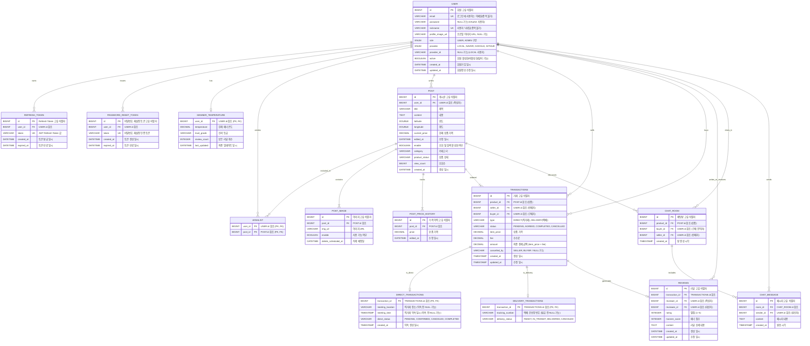

```mermaid
erDiagram
    %% [1] 유저 및 인증 도메인
    USER {
        BIGINT id PK "회원 고유 식별자"
        VARCHAR email UK "로그인에 사용하는 이메일(중복 불가)"
        VARCHAR password "NULL 가능 (OAuth2 사용자)"
        VARCHAR nickname UK "사용자 닉네임(중복 불가)"
        VARCHAR profile_image_url "프로필 이미지 URL, NULL 가능"
        ENUM role "USER, ADMIN 구분"
        ENUM provider "LOCAL, NAVER, GOOGLE, GITHUB"
        VARCHAR provider_id "NULL 가능 (LOCAL 사용자)"
        BOOLEAN active "회원 활성화/비활성화(탈퇴 기능)"
        DATETIME created_at "회원가입 일시"
        DATETIME updated_at "회원정보 수정 일시"
    }

    REFRESH_TOKEN {
        BIGINT id PK "Refresh Token 고유 식별자"
        BIGINT user_id FK "USER.id 참조"
        VARCHAR token UK "JWT Refresh Token 값"
        DATETIME created_at "토큰 발급 일시"
        DATETIME expired_at "토큰 만료 일시"
    }

    PASSWORD_RESET_TOKEN {
        BIGINT id PK "비밀번호 재설정 토큰 고유 식별자"
        BIGINT user_id FK "USER.id 참조"
        VARCHAR token UK "비밀번호 재설정 인증 토큰"
        DATETIME created_at "토큰 생성 일시"
        DATETIME expired_at "토큰 만료 일시"
    }

    MANNER_TEMPERATURE {
        BIGINT user_id PK "USER.id 참조 (PK, FK)"
        DECIMAL temperature "현재 매너 온도"
        VARCHAR trust_grade "신뢰 등급"
        INTEGER review_count "받은 리뷰 개수"
        DATETIME last_updated "최종 업데이트 일시"
    }

    WISHLIST {
        BIGINT user_id PK "USER.id 참조 (PK, FK)"
        BIGINT post_id PK "POST.id 참조 (PK, FK)"
    }

    %% [2] 게시글 도메인
    POST {
        BIGINT id PK "게시글 고유 식별자"
        BIGINT user_id FK "USER.id 참조 (작성자)"
        VARCHAR title "제목"
        TEXT content "내용"
        DOUBLE latitude "위도"
        DOUBLE longitude "경도"
        DECIMAL current_price "현재 상품 가격"
        DATETIME edited_at "수정 일시"
        BOOLEAN enable "조회 및 검색 활성화 여부"
        VARCHAR category "카테고리"
        VARCHAR product_status "상품 상태"
        BIGINT view_count "조회수"
        DATETIME created_at "생성 일시"
    }

    POST_IMAGE {
        BIGINT id PK "이미지 고유 식별자"
        BIGINT post_id FK "POST.id 참조"
        VARCHAR img_url "이미지 URL"
        BOOLEAN enable "사용 가능 여부"
        DATETIME delete_scheduled_at "삭제 예정일"
    }

    POST_PRICE_HISTORY {
        BIGINT id PK "가격 이력 고유 식별자"
        BIGINT post_id FK "POST.id 참조"
        DECIMAL price "상품 가격"
        DATETIME edited_at "수정 일시"
    }

    %% [3] 거래 도메인
    TRANSACTIONS {
        BIGINT id PK "거래 고유 식별자"
        BIGINT product_id FK "POST.id 참조 (상품)"
        BIGINT seller_id FK "USER.id 참조 (판매자)"
        BIGINT buyer_id FK "USER.id 참조 (구매자)"
        VARCHAR type "DIRECT(직거래), DELIVERY(택배)"
        VARCHAR status "PENDING, AGREED, COMPLETED, CANCELLED"
        DECIMAL item_price "상품 가격"
        DECIMAL fee "수수료"
        DECIMAL amount "최종 결제 금액 (item_price + fee)"
        VARCHAR cancelled_by "SELLER, BUYER / NULL 가능"
        TIMESTAMP created_at "생성 일시"
        TIMESTAMP updated_at "수정 일시"
    }

    DIRECT_TRANSACTIONS {
        BIGINT transaction_id PK "TRANSACTIONS.id 참조 (PK, FK)"
        VARCHAR meeting_location "직거래 장소 (약속 전 NULL 가능)"
        TIMESTAMP meeting_time "직거래 약속 일시 (약속 전 NULL 가능)"
        VARCHAR direct_status "PENDING, CONFIRMED, CANCELED, COMPLETED"
        TIMESTAMP created_at "약속 생성 일시"
    }

    DELIVERY_TRANSACTIONS {
        BIGINT transaction_id PK "TRANSACTIONS.id 참조 (PK, FK)"
        VARCHAR tracking_number "택배 운송장 번호 (발급 전 NULL 가능)"
        VARCHAR delivery_status "READY, IN_TRANSIT, DELIVERED, CANCELED"
    }

    %% [4] 리뷰 도메인
    REVIEWS {
        BIGINT id PK "리뷰 고유 식별자"
        BIGINT transaction_id FK "TRANSACTIONS.id 참조"
        BIGINT reviewer_id FK "USER.id 참조 (작성자)"
        BIGINT reviewee_id FK "USER.id 참조 (대상자)"
        INTEGER rating "별점 (1~5)"
        INTEGER manner_score "매너 점수"
        TEXT content "리뷰 상세 내용"
        DATETIME created_at "생성 일시"
        DATETIME updated_at "수정 일시"
    }

    %% [5] 채팅 도메인
    CHAT_ROOM {
        BIGINT id PK "채팅방 고유 식별자"
        BIGINT product_id FK "POST.id 참조 (상품)"
        BIGINT buyer_id FK "USER.id 참조 (구매 문의자)"
        BIGINT seller_id FK "USER.id 참조 (판매자)"
        TIMESTAMP created_at "방 생성 시각"
    }

    CHAT_MESSAGE {
        BIGINT id PK "메시지 고유 식별자"
        BIGINT room_id FK "CHAT_ROOM.id 참조"
        BIGINT sender_id FK "USER.id 참조 (발신자)"
        TEXT content "메시지 내용"
        TIMESTAMP created_at "발송 시각"
    }

    %% --- 관계 설정 ---
    USER ||--o{ REFRESH_TOKEN : "owns"
    USER ||--o{ PASSWORD_RESET_TOKEN : "issues"
    USER ||--o| MANNER_TEMPERATURE : "has"
    USER ||--o{ WISHLIST : "wishes"
    USER ||--o{ POST : "writes"
    USER ||--o{ TRANSACTIONS : "sells"
    USER ||--o{ TRANSACTIONS : "buys"
    USER ||--o{ REVIEWS : "writes_or_receives"
    USER ||--o{ CHAT_ROOM : "chats_in"
    USER ||--o{ CHAT_MESSAGE : "sends"
    POST ||--o{ WISHLIST : "included_in"
    POST ||--|{ POST_IMAGE : "contains"
    POST ||--|{ POST_PRICE_HISTORY : "tracks"
    POST ||--|{ TRANSACTIONS : "ordered"
    POST ||--o{ CHAT_ROOM : "discusses"
    TRANSACTIONS ||--o| DIRECT_TRANSACTIONS : "is_direct"
    TRANSACTIONS ||--o| DELIVERY_TRANSACTIONS : "is_delivery"
    TRANSACTIONS ||--o| REVIEWS : "generates"
    CHAT_ROOM ||--o{ CHAT_MESSAGE : "includes"
```