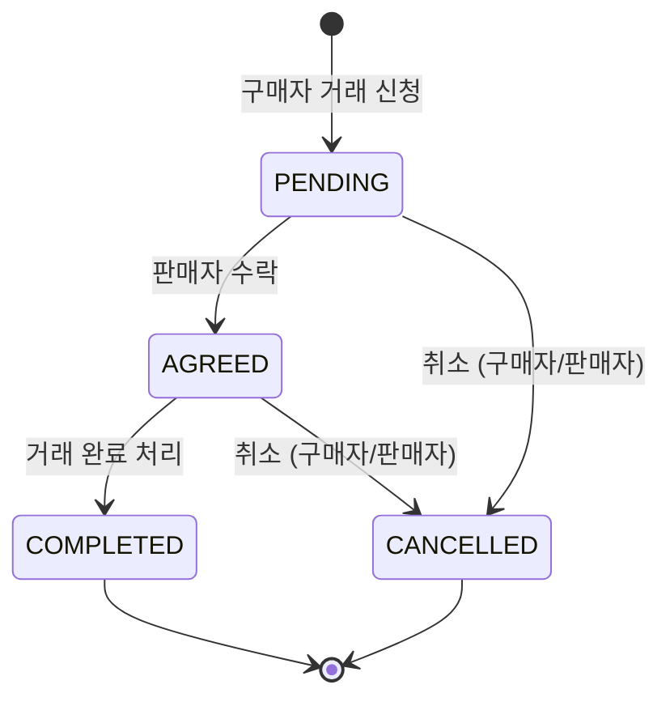
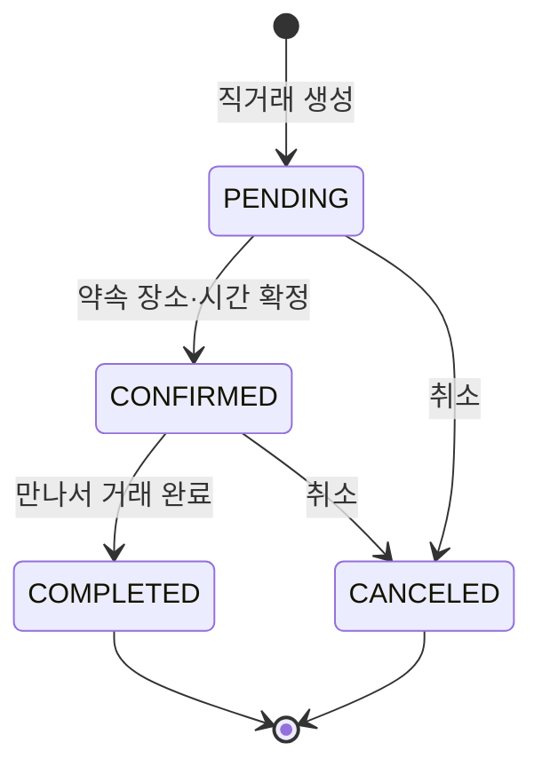
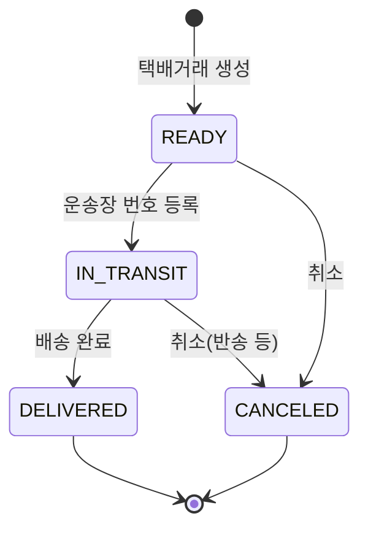

# Paprika 전체 ERD

전체 도메인(유저/인증, 게시글, 거래, 리뷰, 채팅)의 엔티티 관계도입니다.

```mermaid
erDiagram
    %% [1] 유저 및 인증 도메인
    USER {
        BIGINT id PK "회원 고유 식별자"
        VARCHAR email UK "로그인에 사용하는 이메일(중복 불가)"
        VARCHAR password "NULL 가능 (OAuth2 사용자)"
        VARCHAR nickname UK "사용자 닉네임(중복 불가)"
        VARCHAR profile_image_url "프로필 이미지 URL, NULL 가능"
        ENUM role "USER, ADMIN 구분"
        ENUM provider "LOCAL, NAVER, GOOGLE, GITHUB"
        VARCHAR provider_id "NULL 가능 (LOCAL 사용자)"
        BOOLEAN active "회원 활성화/비활성화(탈퇴 기능)"
        DATETIME created_at "회원가입 일시"
        DATETIME updated_at "회원정보 수정 일시"
    }

    REFRESH_TOKEN {
        BIGINT id PK "Refresh Token 고유 식별자"
        BIGINT user_id FK "USER.id 참조"
        VARCHAR token UK "JWT Refresh Token 값"
        DATETIME created_at "토큰 발급 일시"
        DATETIME expired_at "토큰 만료 일시"
    }

    PASSWORD_RESET_TOKEN {
        BIGINT id PK "비밀번호 재설정 토큰 고유 식별자"
        BIGINT user_id FK "USER.id 참조"
        VARCHAR token UK "비밀번호 재설정 인증 토큰"
        DATETIME created_at "토큰 생성 일시"
        DATETIME expired_at "토큰 만료 일시"
    }

    MANNER_TEMPERATURE {
        BIGINT user_id PK "USER.id 참조 (PK, FK)"
        DECIMAL temperature "현재 매너 온도"
        VARCHAR trust_grade "신뢰 등급"
        INTEGER review_count "받은 리뷰 개수"
        DATETIME last_updated "최종 업데이트 일시"
    }

    WISHLIST {
        BIGINT user_id PK "USER.id 참조 (PK, FK)"
        BIGINT post_id PK "POST.id 참조 (PK, FK)"
    }

    %% [2] 게시글 도메인
    POST {
        BIGINT id PK "게시글 고유 식별자"
        BIGINT user_id FK "USER.id 참조 (작성자)"
        VARCHAR title "제목"
        TEXT content "내용"
        DOUBLE latitude "위도"
        DOUBLE longitude "경도"
        DECIMAL current_price "현재 상품 가격"
        DATETIME edited_at "수정 일시"
        BOOLEAN enable "조회 및 검색 활성화 여부"
        VARCHAR category "카테고리"
        VARCHAR product_status "상품 상태"
        BIGINT view_count "조회수"
        DATETIME created_at "생성 일시"
    }

    POST_IMAGE {
        BIGINT id PK "이미지 고유 식별자"
        BIGINT post_id FK "POST.id 참조"
        VARCHAR img_url "이미지 URL"
        BOOLEAN enable "사용 가능 여부"
        DATETIME delete_scheduled_at "삭제 예정일"
    }

    POST_PRICE_HISTORY {
        BIGINT id PK "가격 이력 고유 식별자"
        BIGINT post_id FK "POST.id 참조"
        DECIMAL price "상품 가격"
        DATETIME edited_at "수정 일시"
    }

    %% [3] 거래 도메인
    TRANSACTIONS {
        BIGINT id PK "거래 고유 식별자"
        BIGINT post_id FK "POST.id 참조 (상품)"
        BIGINT seller_id FK "USER.id 참조 (판매자)"
        BIGINT buyer_id FK "USER.id 참조 (구매자)"
        VARCHAR type "DIRECT(직거래), DELIVERY(택배)"
        VARCHAR status "PENDING, AGREED, COMPLETED, CANCELLED"
        DECIMAL item_price "상품 가격"
        DECIMAL fee "수수료"
        DECIMAL amount "최종 결제 금액 (item_price + fee)"
        VARCHAR cancelled_by "SELLER, BUYER / NULL 가능"
        TIMESTAMP created_at "생성 일시"
        TIMESTAMP updated_at "수정 일시"
    }

    DIRECT_TRANSACTIONS {
        BIGINT transaction_id PK "TRANSACTIONS.id 참조 (PK, FK)"
        VARCHAR meeting_location "직거래 장소 (약속 전 NULL 가능)"
        TIMESTAMP meeting_time "직거래 약속 일시 (약속 전 NULL 가능)"
        VARCHAR direct_status "PENDING, CONFIRMED, CANCELED, COMPLETED"
        TIMESTAMP created_at "약속 생성 일시"
    }

    DELIVERY_TRANSACTIONS {
        BIGINT transaction_id PK "TRANSACTIONS.id 참조 (PK, FK)"
        VARCHAR tracking_number "택배 운송장 번호 (발급 전 NULL 가능)"
        VARCHAR delivery_status "READY, IN_TRANSIT, DELIVERED, CANCELED"
    }

    %% [4] 리뷰 도메인
    REVIEWS {
        BIGINT id PK "리뷰 고유 식별자"
        BIGINT transaction_id FK "TRANSACTIONS.id 참조"
        BIGINT reviewer_id FK "USER.id 참조 (작성자)"
        BIGINT reviewee_id FK "USER.id 참조 (대상자)"
        INTEGER rating "별점 (1~5)"
        INTEGER manner_score "매너 점수"
        TEXT content "리뷰 상세 내용"
        DATETIME created_at "생성 일시"
        DATETIME updated_at "수정 일시"
    }

    %% [5] 채팅 도메인
    CHAT_ROOM {
        BIGINT id PK "채팅방 고유 식별자"
        BIGINT product_id FK "POST.id 참조 (상품)"
        BIGINT buyer_id FK "USER.id 참조 (구매 문의자)"
        BIGINT seller_id FK "USER.id 참조 (판매자)"
        TIMESTAMP created_at "방 생성 시각"
    }

    CHAT_MESSAGE {
        BIGINT id PK "메시지 고유 식별자"
        BIGINT room_id FK "CHAT_ROOM.id 참조"
        BIGINT sender_id FK "USER.id 참조 (발신자)"
        TEXT content "메시지 내용"
        TIMESTAMP created_at "발송 시각"
    }

    %% --- 관계 설정 ---
    USER ||--o{ REFRESH_TOKEN : "owns"
    USER ||--o{ PASSWORD_RESET_TOKEN : "issues"
    USER ||--o| MANNER_TEMPERATURE : "has"
    USER ||--o{ WISHLIST : "wishes"
    USER ||--o{ POST : "writes"
    USER ||--o{ TRANSACTIONS : "sells"
    USER ||--o{ TRANSACTIONS : "buys"
    USER ||--o{ REVIEWS : "writes_or_receives"
    USER ||--o{ CHAT_ROOM : "chats_in"
    USER ||--o{ CHAT_MESSAGE : "sends"
    POST ||--o{ WISHLIST : "included_in"
    POST ||--|{ POST_IMAGE : "contains"
    POST ||--|{ POST_PRICE_HISTORY : "tracks"
    POST ||--|{ TRANSACTIONS : "ordered"
    POST ||--o{ CHAT_ROOM : "discusses"
    TRANSACTIONS ||--o| DIRECT_TRANSACTIONS : "is_direct"
    TRANSACTIONS ||--o| DELIVERY_TRANSACTIONS : "is_delivery"
    TRANSACTIONS ||--o| REVIEWS : "generates"
    CHAT_ROOM ||--o{ CHAT_MESSAGE : "includes"
```



---

# 거래 상태 머신 (State Machine)

거래 도메인은 **상위 거래 상태(`TRANSACTIONS.status`)** 와, 방식별 **하위 상태**(직거래 `direct_status` / 택배 `delivery_status`)로 나뉜다.
상위 상태가 전체 거래의 마스터이고, 하위 상태는 진행 세부 단계를 나타낸다.

## 1. 상위 거래 상태 (`TRANSACTIONS.status`)

| 상태 | 의미 | 진입 조건 |
|------|------|-----------|
| `PENDING` | 거래 요청(구매자 신청 직후) | 구매자가 거래 신청 |
| `AGREED` | 거래 확정(판매자 수락) | 판매자가 신청 수락 |
| `COMPLETED` | 거래 완료 | 직거래/택배 완료 처리 |
| `CANCELLED` | 거래 취소 | 완료 전 단계에서 취소 |



### 전이 규칙

| 시작 | 종료 | 행위자 | 비고 |
|------|------|--------|------|
| `PENDING` | `AGREED` | 판매자 | 신청 수락 |
| `PENDING` | `CANCELLED` | 구매자/판매자 | 수락 전 취소 |
| `AGREED` | `COMPLETED` | 구매자/판매자 | 직거래·택배 완료 시 |
| `AGREED` | `CANCELLED` | 구매자/판매자 | 진행 중 취소 |
| `COMPLETED` | (없음) | - | 종료 상태, 되돌림 불가(반품은 별도) |
| `CANCELLED` | (없음) | - | 종료 상태 |

## 2. 직거래 하위 상태 (`DIRECT_TRANSACTIONS.direct_status`)

| 상태 | 의미 |
|------|------|
| `PENDING` | 약속(장소/시간) 미확정 |
| `CONFIRMED` | 약속 장소·시간 확정 |
| `COMPLETED` | 직거래 완료 |
| `CANCELED` | 약속 취소 |



> `direct_status = COMPLETED` 가 되면 상위 `TRANSACTIONS.status` 도 `COMPLETED` 로 전이된다.

## 3. 택배 하위 상태 (`DELIVERY_TRANSACTIONS.delivery_status`)

| 상태 | 의미 |
|------|------|
| `READY` | 배송준비(운송장 발급 전/포장) |
| `IN_TRANSIT` | 배송중(운송장 등록 후) |
| `DELIVERED` | 배송완료 |
| `CANCELED` | 취소 |



> `delivery_status = DELIVERED` 가 되면 상위 `TRANSACTIONS.status` 도 `COMPLETED` 로 전이된다.

## 4. 상위 ↔ 하위 상태 연동

| 상위(`TRANSACTIONS.status`) | 직거래(`direct_status`) | 택배(`delivery_status`) |
|------|------|------|
| `PENDING` | `PENDING` | `READY` |
| `AGREED` | `CONFIRMED` | `READY` / `IN_TRANSIT` |
| `COMPLETED` | `COMPLETED` | `DELIVERED` |
| `CANCELLED` | `CANCELED` | `CANCELED` |

## 5. 상품 상태 연동 (`POST.product_status`)

| 거래 이벤트 | 상품 상태 변경 |
|-------------|----------------|
| 거래 신청/확정(`PENDING`/`AGREED`) | `SELLING` → `RESERVED` |
| 거래 완료(`COMPLETED`) | `RESERVED` → `SOLD` |
| 거래 취소(`CANCELLED`) | `RESERVED` → `SELLING` (복구) |

---

# 거래 도메인 테이블 스키마 (DDL)

> MySQL 8.x 기준. 상태값은 애플리케이션(enum)에서 관리하며 컬럼은 `VARCHAR`로 저장한다.

## `transactions` (거래 공통)

```sql
CREATE TABLE transactions (
    id           BIGINT       NOT NULL AUTO_INCREMENT COMMENT '거래 고유 식별자',
    post_id      BIGINT       NOT NULL COMMENT 'POST.id 참조 (상품)',
    seller_id    BIGINT       NOT NULL COMMENT 'USER.id 참조 (판매자)',
    buyer_id     BIGINT       NOT NULL COMMENT 'USER.id 참조 (구매자)',
    type         VARCHAR(20)  NOT NULL COMMENT 'DIRECT, DELIVERY',
    status       VARCHAR(20)  NOT NULL DEFAULT 'PENDING' COMMENT 'PENDING, AGREED, COMPLETED, CANCELLED',
    item_price   DECIMAL(12,2) NOT NULL COMMENT '상품 가격',
    fee          DECIMAL(12,2) NOT NULL DEFAULT 0 COMMENT '수수료',
    amount       DECIMAL(12,2) NOT NULL COMMENT '최종 결제 금액 (item_price + fee)',
    cancelled_by VARCHAR(20)  NULL COMMENT 'SELLER, BUYER / NULL 가능',
    created_at   TIMESTAMP    NOT NULL DEFAULT CURRENT_TIMESTAMP COMMENT '생성 일시',
    updated_at   TIMESTAMP    NOT NULL DEFAULT CURRENT_TIMESTAMP ON UPDATE CURRENT_TIMESTAMP COMMENT '수정 일시',
    PRIMARY KEY (id),
    CONSTRAINT fk_tx_post   FOREIGN KEY (post_id)   REFERENCES post (id),
    CONSTRAINT fk_tx_seller FOREIGN KEY (seller_id) REFERENCES `user` (id),
    CONSTRAINT fk_tx_buyer  FOREIGN KEY (buyer_id)  REFERENCES `user` (id),
    INDEX idx_tx_post   (post_id),
    INDEX idx_tx_seller (seller_id, created_at),
    INDEX idx_tx_buyer  (buyer_id, created_at)
) COMMENT '거래 공통 정보';
```

## `direct_transactions` (직거래 상세)

```sql
CREATE TABLE direct_transactions (
    transaction_id   BIGINT      NOT NULL COMMENT 'TRANSACTIONS.id 참조 (PK, FK)',
    meeting_location VARCHAR(255) NULL COMMENT '직거래 장소 (약속 전 NULL 가능)',
    meeting_time     TIMESTAMP   NULL COMMENT '직거래 약속 일시 (약속 전 NULL 가능)',
    direct_status    VARCHAR(20) NOT NULL DEFAULT 'PENDING' COMMENT 'PENDING, CONFIRMED, CANCELED, COMPLETED',
    created_at       TIMESTAMP   NOT NULL DEFAULT CURRENT_TIMESTAMP COMMENT '약속 생성 일시',
    PRIMARY KEY (transaction_id),
    CONSTRAINT fk_direct_tx FOREIGN KEY (transaction_id) REFERENCES transactions (id) ON DELETE CASCADE
) COMMENT '직거래 상세 (1:1)';
```

## `delivery_transactions` (택배거래 상세)

```sql
CREATE TABLE delivery_transactions (
    transaction_id  BIGINT      NOT NULL COMMENT 'TRANSACTIONS.id 참조 (PK, FK)',
    tracking_number VARCHAR(50) NULL COMMENT '택배 운송장 번호 (발급 전 NULL 가능)',
    delivery_status VARCHAR(20) NOT NULL DEFAULT 'READY' COMMENT 'READY, IN_TRANSIT, DELIVERED, CANCELED',
    PRIMARY KEY (transaction_id),
    CONSTRAINT fk_delivery_tx FOREIGN KEY (transaction_id) REFERENCES transactions (id) ON DELETE CASCADE
) COMMENT '택배거래 상세 (1:1)';
```

## 설계 메모

- **1:1 분리**: `transactions`(공통) ↔ `direct_transactions`/`delivery_transactions`(방식별 상세). `type` 값에 따라 둘 중 하나만 존재한다.
- **금액**: `amount = item_price + fee` 를 저장 시 계산해 보관(조회 편의). 부동소수 오차 방지를 위해 `DECIMAL` 사용.
- **상태 저장**: enum을 `VARCHAR`로 저장(가독성). DB `ENUM` 타입 대신 애플리케이션에서 검증.
- **취소 주체**: `cancelled_by`로 SELLER/BUYER 구분, 취소 아닐 때 NULL.
- **하위 테이블 PK = FK**: `transaction_id`가 PK이자 FK로, 상위 거래와 1:1 보장.
- **TBD**: 수수료율(%) 확정, `SOLD` 복구 허용 여부, 반품/환불 흐름은 기능요구서 10장 참조.
